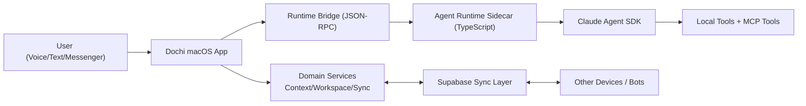

# 03. Target System Architecture

## 1) 목표 구조 요약

Dochi 리라이트의 목표 구조는 아래 3계층이다.

1. Experience Layer (SwiftUI/macOS UX)
2. Domain Layer (Context, Memory, Workspace, Device orchestration)
3. Agent Runtime Layer (Claude Agent SDK Sidecar)

핵심은 "앱은 도메인과 UX", "런타임은 추론 엔진"으로 책임을 고정하는 것이다.

## 2) 구성 요소

### 2.1 Experience Layer

- 음성/텍스트/메신저 입력 수집
- 사용자 확인 UI (권한 승인)
- 세션 상태/스트리밍 렌더링
- 도구 실행 카드 및 결과 피드백

### 2.2 Domain Layer

- Workspace/Agent/Profile 관리
- 4계층 컨텍스트 저장/조회
- 동기화 큐와 디바이스 라우팅
- 정책 엔진(권한, 공유 범위, 데이터 분류)

### 2.3 Agent Runtime Layer

- Claude Agent SDK Client lifecycle
- 세션 생성/재개/중단
- 도구 호출 브리지
- Hook pipeline (policy, logging, memory extraction)

## 3) 시스템 토폴로지

## 4) 요청 처리 시퀀스

1. 입력 채널이 `workspaceId`, `agentId`, `userId`를 해석한다.
2. Domain Layer가 컨텍스트 스냅샷을 구성한다.
3. Runtime Bridge가 세션을 열거나 재개한다.
4. Runtime가 SDK `query/stream` 호출을 실행한다.
5. 도구 호출은 Bridge를 거쳐 앱 도메인 도구 또는 MCP 도구로 라우팅된다.
6. 결과는 Hook과 Domain Policy를 통과 후 사용자에게 반환된다.
7. 메모리 후보는 비동기 파이프라인으로 반영된다.

## 5) 경계 정의

### 앱이 책임지는 것

- 사용자 식별/워크스페이스 식별
- 메모리 저장소 정합성
- 디바이스 할당/실행 위치 결정
- 사용자 확인 UX

### 런타임이 책임지는 것

- 모델 호출, 스트리밍, tool-use loop
- 서브에이전트 호출
- 세션 지속성(런타임 관점)
- 훅 기반 실행 정책

### 클라우드가 책임지는 것

- 인증/워크스페이스 membership
- 메시지 큐/동기화 상태
- 디바이스 상태 교환

## 6) 설계 결정

- 단일 런타임 프로세스를 기본으로 하고, 필요 시 워크스페이스 단위 분리 실행을 고려한다.
- SDK 구성은 선언 파일 기반(환경별 profile)으로 관리한다.
- 기존 커스텀 LLM Adapter는 제거 대상이다.

